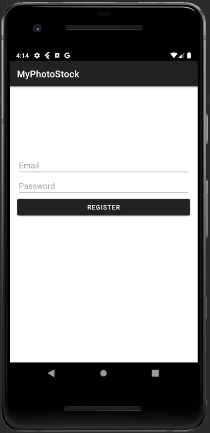
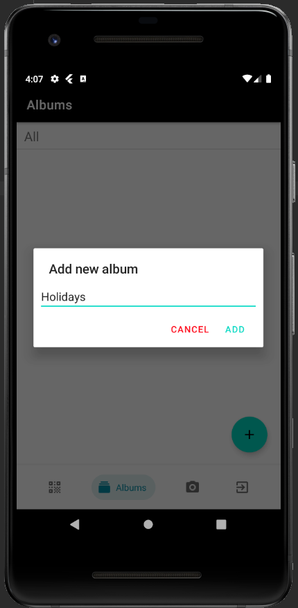

# MPS - MyPhotoStock
> Android, Kotlin, Firebase(Authentication, Realtime Database, Storage)

A mobile application that functions as a **digital photo organizer**

## Functionalities: 
* The application is designed for Android smartphones
* Ability to quickly add new photos
* Selecting the action after taking the photo
* Create photo albums
* Manage photo albums
* Delete photo albums
* Adding a new photo to an existing or new album
* Adding more photos to an existing or new album
* An additional module where you can store data from scanned barcodes / QR codes
* Ability to add new entries by scanning the barcode / QR
* Ability to delete entries

## Screenshots
### Login screen

### User registration screen

### Albums screen

### Add album

### Album preview

### Camera screen to take pictures

### Photo preview screen

### Photo preview in the album
User can change album or delete picture.

